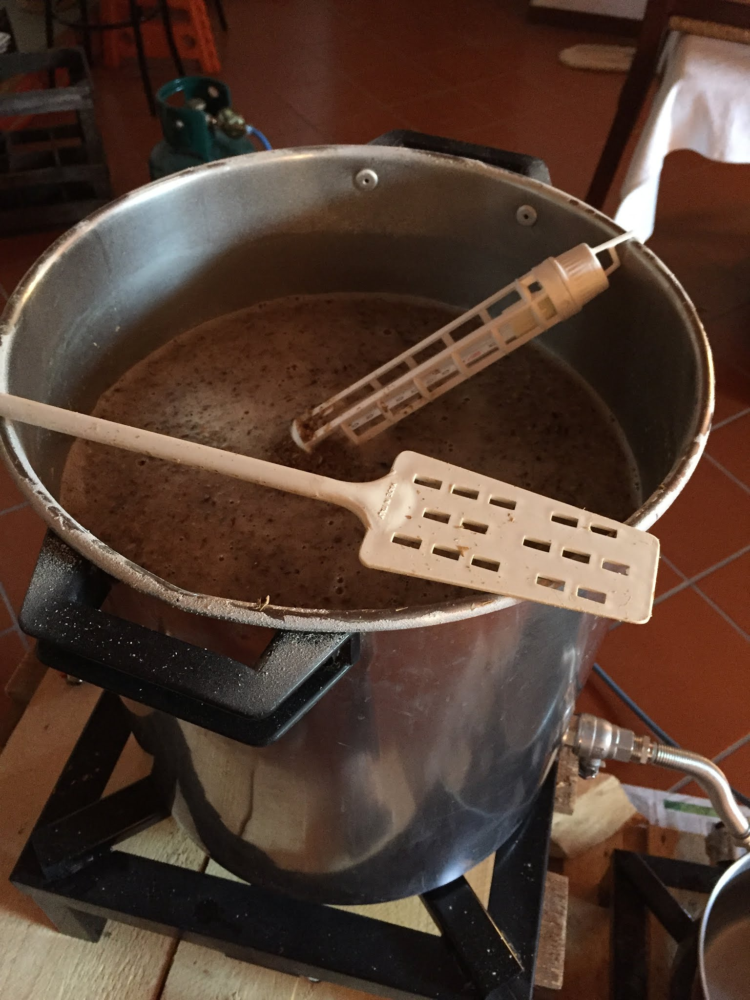

American Pale Ale, cotta del 16 ottobre 2016.

#### Fermentabili
| Tipologia               | Percentuale |
|-------------------------|-------------|
| Malto Pale              | 95%         |
| Malto Crystal (200 Ebc) | 5%          |

#### Luppoli
| Varietà    | Tempo  | Amaro   |
|------------|--------|---------|
| Chinook    | 60 min | 26 IBU  |
| Willamette | 20 min | 6,7 IBU |
| Chinook    | 20 min | 15 IBU  |
| Willamette | 5 min  | 2,3 IBU |

#### Lievito
Fermentis Safale US-05

Cotta buttata perché infetta, oltre a questo avevamo avuto problemi di efficienza (OG 1030 contro 1056 previsti). La ricetta è quasi una copia della pale ale che avevamo fatto ad agosto, una pale ale al confine delle amber.

A vederle ora, le ricette, stonano completamente con lo stile. Troppo poco luppolo!

