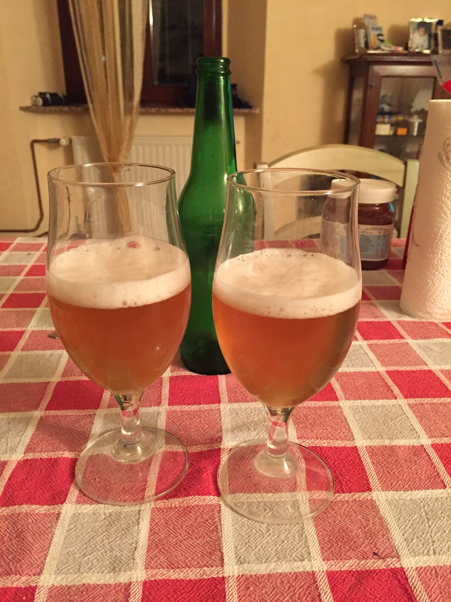

Questo sarà il primo di una serie di post sulle birre del passato. Nell'ottica di migrare dal vecchio blog ho deciso di reimportare tutti i post e formattarli in markdown.

Siccome saranno post scritti nel passato e successivamente riformattati più volte potrete trovare incongruenze nei tempi verbali e imprecisioni nelle schede di degustazione. Ma anche questo fa parte del gioco. Per lo stesso motivo le date dei post sono fittizie per questioni di ordinamento.

Nel 2016 ho cominciato a produrre birre insieme a due amici con il marchio Ryan Biller.  
Dopo la prima birra da kit luppolato cominciammo subito con l'all grain con un impianto a tre tini alimentato a gas (descritto in un post dedicato).  
Le prime cotte ci vennero bene per gli standard dell'epoca e ci diedero slancio nella nostra produzione. Qualche problemino però cominciò a spuntare nella seconda metà dell'anno.

Tornando alla birra, questa fu una Mexican lager da kit luppolato Cooper prodotta il 6 marzo 2016.
Ci ha permesso di prendere confidenza con la fermentazione, per il resto birra poco riuscita di sapore sidroso, dimenticabile.

