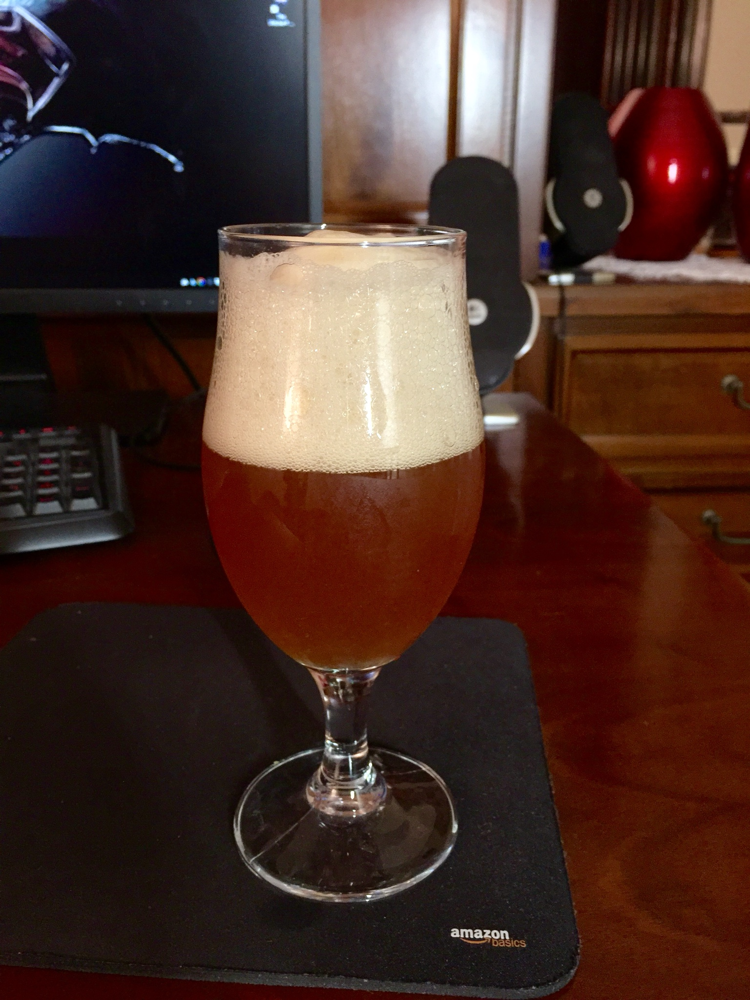

Birra ambrata in stile inglese prodotta il 17 luglio 2016 e imbottigliata il 6 luglio.

#### Fermentabili
| Tipologia                        | Peso   |
|----------------------------------|--------|
| Malto Pale Maris Otter           | 4,5 kg |
| Malto Crystal                    | 500 gr |
| Zucchero caramellato (invertito) | 400 gr |

#### Luppoli
| Varietà       | Tempo  |
|---------------|--------|
| First Gold    | 60 min |
| E.K. Goldings | 30 min |
| E.K. Goldings | 10 min |
| E.K. Goldings | DH     |

#### Lievito
Fermentis Safale S-04

#### Aspetto
Ramato, schiuma bianca vigorosa e persistente.

#### Olfatto
Salta subito al naso l'inconfondibile ek golding e il malto crystal, tipici di un inglese.

#### Sapore
Si riconfermano le sensazioni al naso, forse l'unico difetto è qualche nota alcolica indesiderata. 

#### Palato
Corpo medio, carbonazione elevata.

