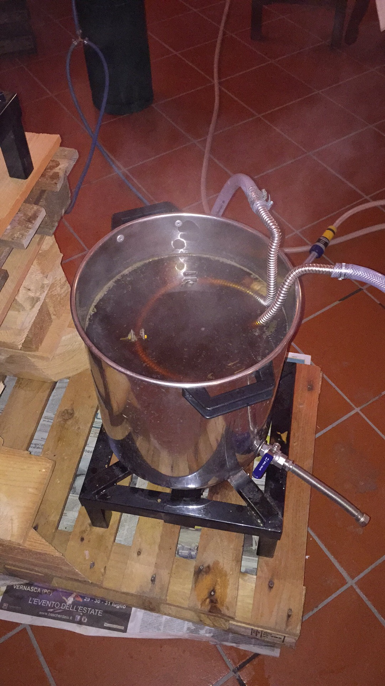

Birra al miele di castagno prodotta il 18 settembre 2016.

#### Fermentabili
| Tipologia               | Percentuale |
|-------------------------|-------------|
| Malto Pale              | 76%         |
| Malto Crystal (200 Ebc) | 7%          |
| Malto Monaco            | 14%         |
| Miele                   | 3%          |

#### Luppoli
| Varietà              | Tempo  | Amaro     |
|----------------------|--------|-----------|
| Super Styrian Aurora | 60 min | 25,5 IBU  |
| Styrian Goldings     | 30 min | 4,2 IBU   |
| Styrian Goldings     | 15 min | 1 IBU     |

#### Lievito
Fermentis Safale US-05

Questa birra al miele piaceva agli altri due "birrai" ma non a me. Per tempo ho avuto il sospetto che il forte aroma di miele sostenuto dagli altri non fosse altro che eccessiva ossidazione e una sospetta infezione. Infatti dividemmo il mosto dopo la fermentazione primaria in 11 litri circa in due fermentatori da 32 lt (uno con styrian golding in dh e l'altro con chips di legno precedentemente imbevute nel Jack Daniel's). Le ultime bottiglie erano inservibili per l'eccessivo gushing.

Nonostante questi errori è un tipo di birra che voglio rifare. Probabilmente caratterizzandola di più con un lievito e luppolo inglese, magari usando solo un malto speciale (via il monaco). Potrebbe essere classificabile Extra Special Bitter se si impiega del miele? Dopotutto gli stili sono solo basi di partenza...

