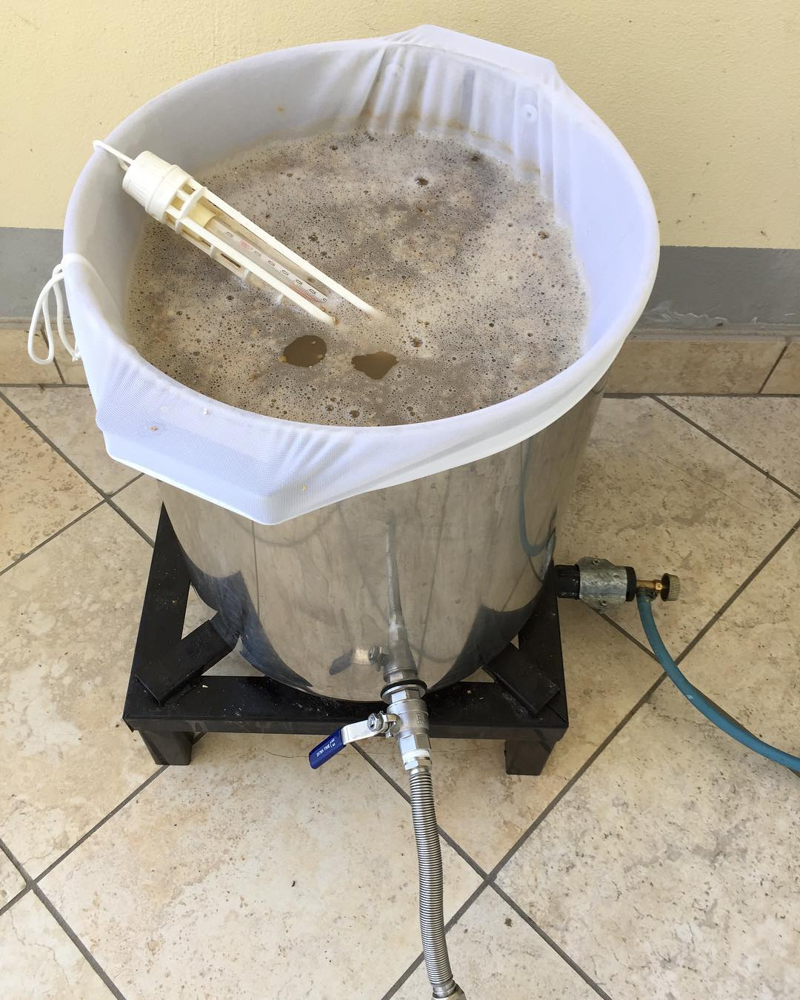

White IPA prodotta l'11 giugno 2017.

#### Fermentabili
| Tipologia           | Peso   |
|---------------------|--------|
| Malto Pilsner       | 2,5 kg |
| Malto Weizen        | 2 kg   |
| Fiocchi di frumento | 400 gr |
| Fiocchi d'avena     | 100 gr |

#### Luppoli
| Varietà              | Tempo  | Amaro   | Quantità |
|----------------------|--------|---------|----------|
| Hallertauer Herkules | 60 min | 30 IBU  | -        |
| Saaz                 | 0 min  | -       | 2,5 g/l  |
| Saaz                 | DH     | -       | 2,5 g/l  |

#### Lievito
Fermentis Safbrew S-33

#### Commenti
La birra venne discretamente bene, piuttosto beverina (ottenni una bella attenuazione nonostante l's33). Sulle ultime bottiglie ho riscontrato un po' di gushing e lievissima acidità.

Definirla white IPA forse è eccessivo, è più una blanche luppolata.

