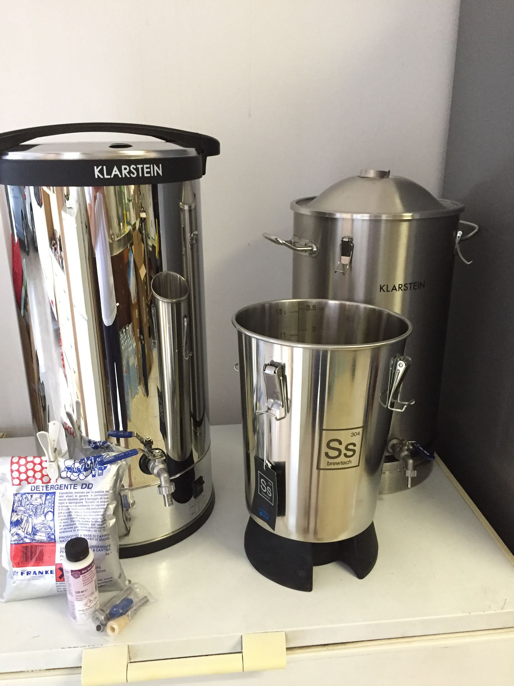
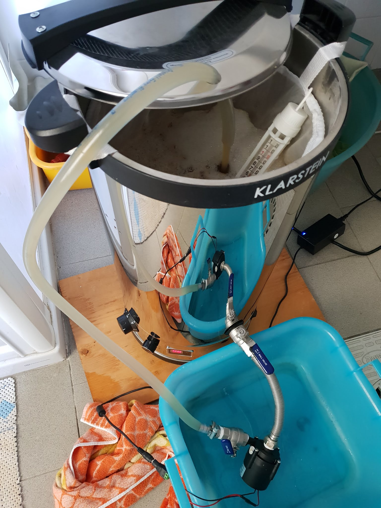
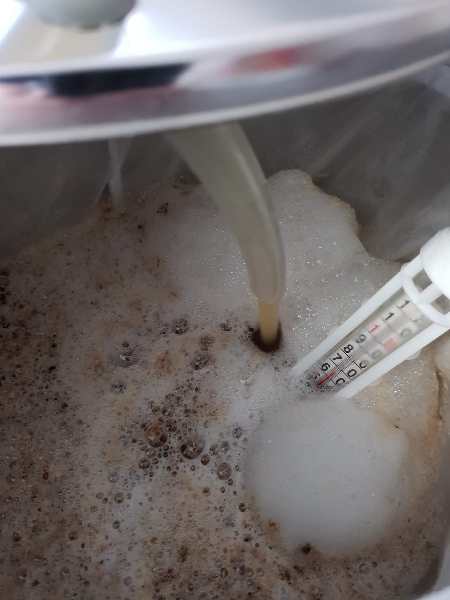
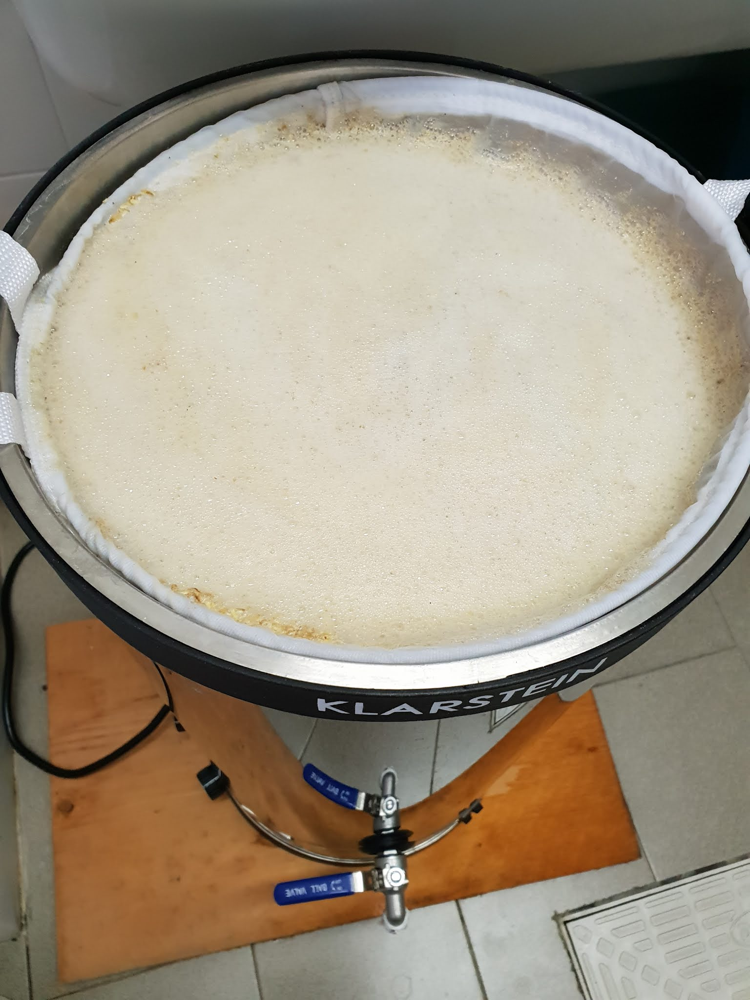
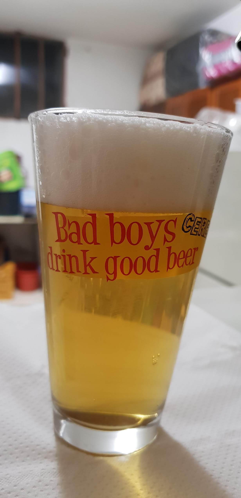
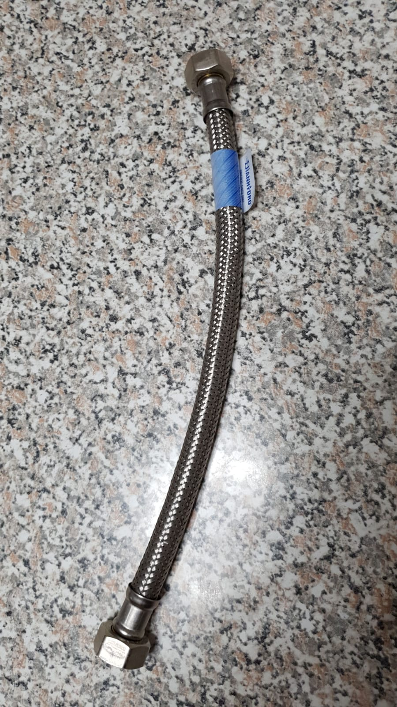
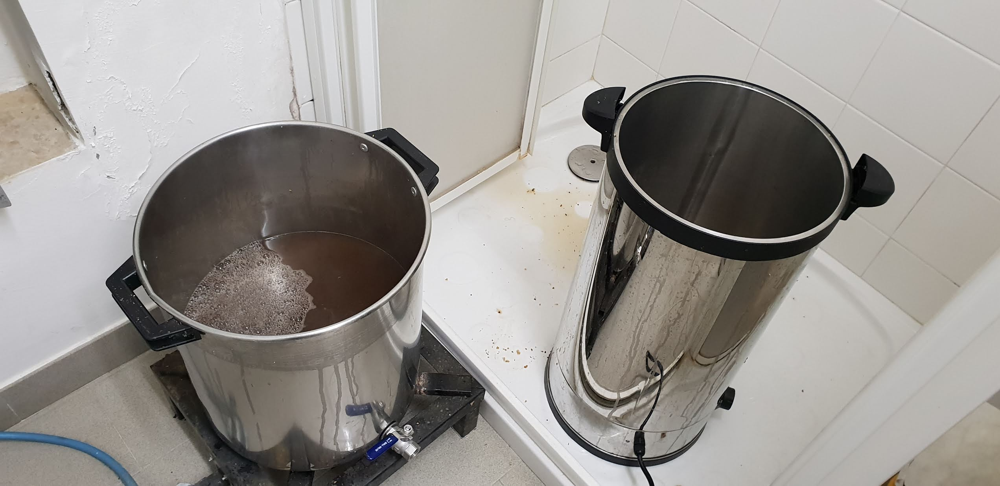

Dopo una lunga pausa produttiva durata da dicembre 2017 a luglio 2017 a causa di un nuovo lavoro e dell'abbandono del secondo socio rimasto ho deciso di ricominciare da solo nella mia attività birraria con un impianto biab elettrico Klarstein Füllhorn (cioè il famoso beerfest con display digitale).

Mi sembrava infatti più conveniente (al netto degli accessori in più) rispetto al più comune all in one Klarstein Mundschenk, con stessa capacità e potenza (30 litri e 2500 watt), venduto al triplo del prezzo (129 contro 399 euro circa). 

Di questo modello ne esistono diverse varianti in commercio, alcune con capacità di 40 litri anziché 30 e rimarchiate dai diversi rivenditori, spesso vendute in bundle con serpentine, mulini, fermentatori e con un kit all grain in omaggio. Ne esiste anche una versione più grande da 50/55 litri con resistenza da 3000 watt, ad un costo di circa 100 euro in più.

Le cotte si sono quindi ridimensionate dai classici 23 litri in fermentatore ai 9 attuali mentre ho cercato di ottimizzare i tempi ripensando in toto la produzione. Per la fermentazione gli ho abbinato il "finto troncoconico" Brewbucket Mini della SS Brewtech (l'unico modello di fermentatore inox così piccolo sul mercato, a parte certi fustini per olio però da modificare). Per cotte più grandi (circa 15 litri) ho utilizzato il fermentatore Klastein a fondo piatto da 30 litri.

### Prima cotta
Nella prima cotta decisi di utilizzarlo così com'è, senza pompa per ricircolo e con la vecchia sacca biab. I vantaggi riscontrati sono stati:
- Temperature dell'acqua riportate sul controller digitale fedeli a quelle misurate con il termometro analogico a gabbietta (al più un grado di differenza, considerando anche che è la precisione massima di entrambi).
- Velocità nelle rampe di temperatura alla potenza massima.
- Vigorosità della bollitura con la potenza massima.
- Ottima coibentazione di serie grazie al doppio spessore (cosa che purtroppo manca ai klarstein col cestello).
- Silenziosità e compattezza.
- Nessun problema nel filtrare i luppoli in fiore a fine bollitura grazie al doppio fondo forato.
- Avendo la resistenza interna il calore perso è molto inferiore rispetto al fornellone a gas e anche l'ambiente si scalda molto meno.
- Sicurezza rispetto al gas e nessun tempo perso per recuperare la bombola, montare gli attacchi, accenderla/spegnerla e riporla (dopo la cotta: ma ho spento la bombola? E andavo a ricontrollare nel cuore della notte).

Di contro le criticità riscontrate sono state
- Volume di mash in poco spazio perché la sacca si adattava male alla pentola alta e stretta
- Differenza di temperatura tra la sacca coi grani (misurata sempre col termometro a gabbietta galleggiante) e quella sul fondo della pentola (visualizzata sul display)
- Bollitura poco vigorosa con la sola resistenza da 1600w come consigliato dalle istruzioni nostante i pochi litri (circa 12-13, non li ho misurati ma partivo da 16 litri in mash)

### Seconda cotta
Le criticità sono state risolte nella cotta successiva implementando il ricircolo con la pompa (TOPSFLO in XYRON PPE 12Vcc-34W presa su birramia, ora c'è la nuova da 48w) a cui ho messo un rubinetto sulla mandata altrimenti sparava fuori una ventina di litri al minuto e la sacca da biab della klarstein, di ottima fattura (più spessa delle normali, ha anche due cerchi metallici alle estremità per tenerla nella giusta forma cilindrica delle dimensioni della pentola).

Inoltre il mosto bollì vigorosamente con entrambe le resistenze accese (1600w+900w=2500w) e mi ritrovai i giusti litri in fermentatore.

Dopo queste due migliorie la cotta del 2018 fu quella con meno problemi in assoluto di sempre, non mi sembrava reale. L'unico problema fu la dilatazione del doppio fondo che si piegò in balia del calore della resistenza. In effetti il sistema non brilla per qualità costruttiva, poco male, è bastato poco per raddrizzarlo.

### Terza cotta
I problemi cominciarono nella cotta successiva. Ho avuto problemi di perdite del rubinetto nell'intercapedine interna, fra i due fogli d'acciaio che realizzano la parete della pentola. Me ne accorsi solo verso il mash in che sul pavimento era comparsa magicamente dell'acqua, quindi staccai tutto, svuotai la pentola, smontai e rimontai il rubinetto e il problema sembrava risolto. 

Poi cominciarono a perdere gli attacchi della pompa, spazientito decisi di non fare il ricircolo. Si spense una volta il sistema durante il mash, probabilmente le perdite d'acqua dovevano aver intaccato la circuiteria. 

Feci inoltre l'errore di non mettere il doppiofondo per il luppolo e prontamente si ostruì il rubinetto con i coni di luppolo. Con l'autosifone (che odio più di qualsiasi cosa) riuscì a portare il fango nel fermentatore. 

Nelle foto qui sotto lo vedete al limite con 24 litri d'acqua e 5kg di grani (per 15 litri finali)

La birra finita che venne limpida nonostante il macello. Winterizzate gente!

### Quarta cotta
La cotta dopo iniziò bene. Avevo sistemato le perdite alla pompa attraverso il semplice uso di un flessibile in inox femmina-femmina (qua sopra nella foto a destra), controllando in fase d'acquisto che il tubo di gomma interno fosse alimentare e resistesse alle temperature di mash e no, stavolta non ci ho fatto un filtro bazooka...

Accesi quindi il ricircolo e tutto andò liscio finché la pompa non si ostruì con quelle che sembravano farine. Molto strano pensai, visto che la maglia della sacca era molto fine, in ogni caso anche stavolta decisi di fare a meno della pompa e staccai tutto. 

Qualche minuto dopo il klarstein cominciò a spegnersi ad intervalli di qualche minuto e ogni volta alla riaccensione dovevo impostare la temperatura manualmente. Speravo di arrivare almeno alla conclusione del mash in quel calvario (ero in protein rest...) ma morì definitivamente 💀.

### Riflessioni sui "quasi" all in one
Il problema di fondo è avere parte elettrica direttamente sopra la pentola, quindi sempre a rischio infiltrazioni e ciò mi ha creato anche qualche problema nel pulire la pentola.  
Occorre prestare qualche attenzione in più, nel mio caso ho appoggiato la pentola nella doccia tenendola inclinata sul battitacco della porta (la base di plastica della pentola proteggeva il fondo dall'acqua) e ho usato il soffione facendo attenzione a non bagnare l'esterno.  
Il tutto tenendo il cavo d'alimentazione sempre al di fuori dal perimetro della doccia.

Almeno i veri BIAP hanno pompa integrata e il lavaggio è relativamente più semplice (ho provato in questi giorni a fare la prima pulizia del brauheld che userò a breve). E non avendo la doppia parete isolante (che sarebbe un difetto per l'efficienza termica) ci si può rendere subito conto della perdita che sarebbe verso l'esterno.

Confesso che stavo per mettere una pietra sopra sul capitolo bollitori elettrici cercando soluzioni per crearmi una pentola ad hoc per l'induzione (ad esempio la ss brewkettle) oppure forare una delle due pentole in inox e installare una resistenza elettrica.  
Nel primo caso avrei avuto problemi a pilotare un fornello ad induzione con un pid (non ho trovato molto online e comunque dovrei smontare il fornello con tutti i rischi del caso) e nel secondo avrei dovuto rivolgermi a qualcuno bravo nel praticare fori e comprarmi la resistenza con attacco e un controller, che costerebbe sia soldi che tempo. 

Entrambe le soluzioni rendono l'impianto più modulare e hanno il grosso vantaggio del backup con fornellone. Sarebbe bastato poco infatti, nel caso di rotture di cose elettriche (come mi è successo), prendere la pentola e metterla sopra il caro vecchio bruciatore che, gas permettendo, ha tutto meno che problemi di affidabilità.

### Sostituzione
Intanto il bollitore partì per Berlino in assistenza (ottima esperienza) e mi proposero il rimborso oppure di aspettare la prossima fornitura del fullhorn (a fine 2018).   Inizialmente ripensai al progetto iniziale per trasformarlo in un biap facendo il cestello a partire da una canna fumaria in inox (il famoso pipe anziché bag) ma accantonai l'idea per motivi di tempo e dubbi nelle mie capacità (o più che altro pazienza) nel fai da te. 

Inoltre è veramente difficile realizzare un supporto per la pompa con tubo d'acciaio e non lasciarla penzolante insieme al tubo di ricircolo come qualche foto più sopra, inoltre andrebbe fatto anche un pulsante ON/OFF e un controller come smartpid che l'alimenti a 12v (per non dover attaccare/staccare l'alimentatore esterno e il suo precario collegamento).
Approfittai quindi dell'uscita del nuovo all in one klarstein scontato per sostituirlo (d'altronde è Natale...).