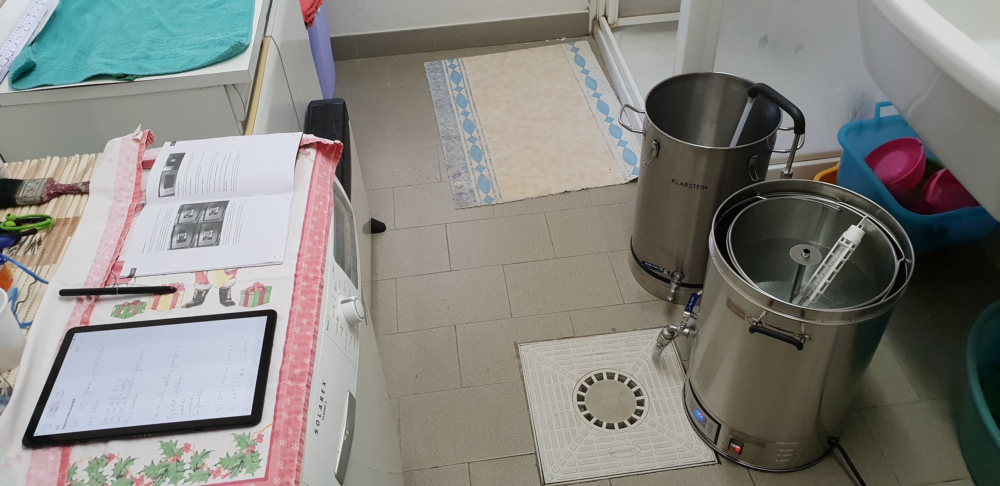
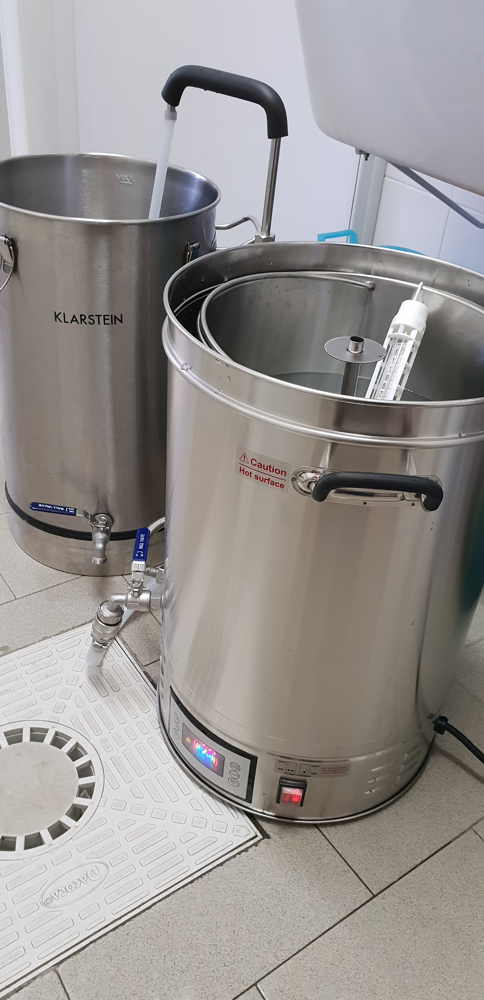
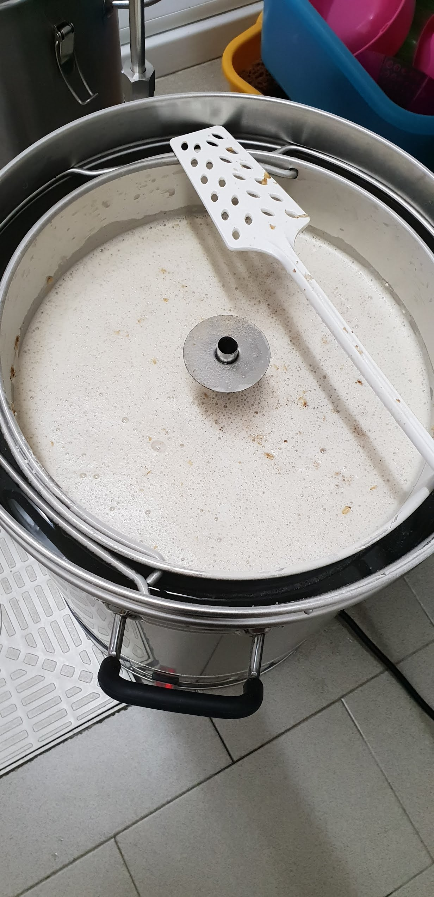
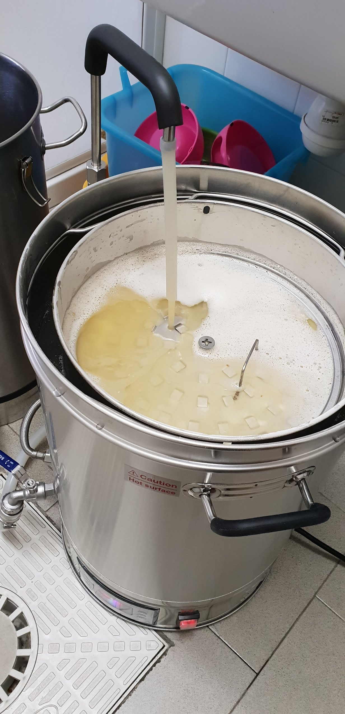
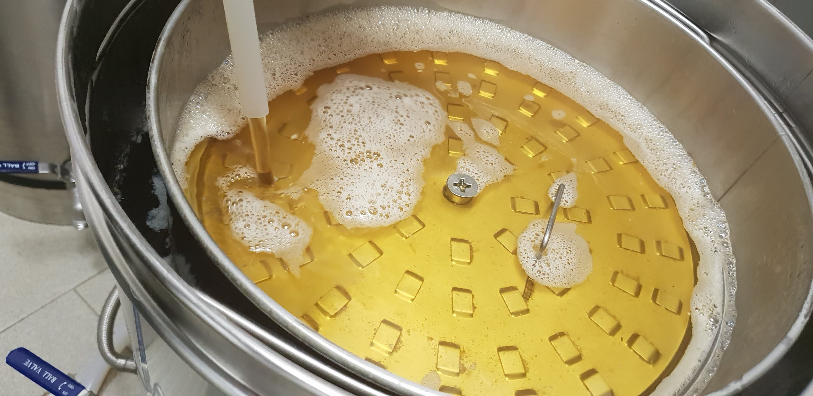
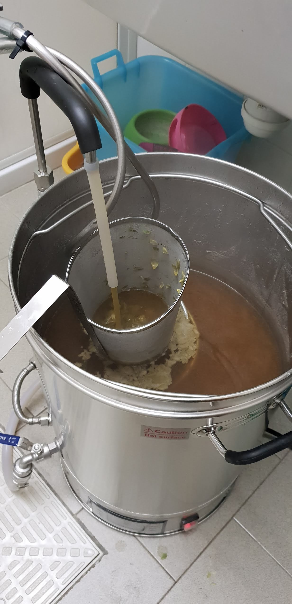
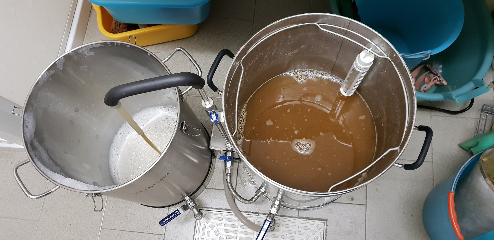

Alla fine del precedente post ho accennato al Klarstein Brauheld preso alla fine dell'anno. Questo è il post delle prime impressioni dell'impianto.

### Pulizia iniziale
Qualche settimana fa ho fatto la prima pulizia e ho semplicemente fatto ricircolare acqua e oxi san nelle dosi consigliate (40 grammi per 10 litri) per mezz'ora a 50 gradi, lavando con il tubo del ricircolo superiore anche il cestello e i bordi della pentola.  
In molti consigliano il PWB o il prodotto per la pulizia del grainfather ma non li avevo.

Essendo un prodotto basico per evitare le incrostazioni bianche ho fatto un passaggio con 5 litri d'acqua e 10ml di starsan, nelle solite concentrazioni per sanificare. Ho risciacquato il grosso della schiuma prodotta con acqua e l'ho riposto facendolo scolare. All'inzio della prima cotta ho inserito semplicemente l'acqua di mash senza ripulirlo.

### Set del controller
Una delle poche note dolenti che ho visto all'inizio è il controller che a differenza dei precedenti AIO della stessa famiglia ha solo 4 step anziché 9.  
Nonostante ciò il sensore di temperatura è preciso e riportava gli stessi valori del termometro analogico. Queste sono gli step che ho impostato inizialmente:

| Tempo | Temperatura | Potenza |
|-------|-------------|---------|
|10 min | 50°         | 2000 W  |
|60 min | 66°         | 2000 W  |
|15 min | 78°         | 2000 W  |
|60 min | 110°        | 2200 W  |

### Mash
Ho deciso di usare la pentola senza coibentazione per vedere come si comporta "stock". La prima rampa ci ha messo circa 40 minuti. Ho previsto il primo step per inserire i grani, mescolare, uniformare la temperatura e mettere la copertura dei grani, lo stopper del troppo pieno e avviare il ricircolo e prendere la prima misura del ph. 

Non serviva ovviamente il protein rest con il malto pale, se dovessi fare protein rest allungherei questo step (anziché 50° dovevano essere 52° ma mi sono sbagliato). In tal caso inserirei i grani pochi minuti prima di arrivare al target in modo che la temperatura sia costante per tutto lo step e non perdo tempo a risalire.

La prima misura del ph senza i grani (dopo aver disciolto i sali e l'acido lattico) riportava un ph di 6,7. Dopo l'aggiunta dei grani è sceso a 6,4 (1 punto superiore al teorico, non poco) quindi ho fatto una nuovo inserimento di 2ml di lattico che l'ha portato a 5,8 e infine ancora una correzione di 1ml che ha portato il ph a  5,6.

Siccome è il valore limite del range ottimale del ph ho deciso di non correggerlo più (ho sempre atteso un po' di minuti tra le misurazioni affinché il mosto ricircolasse).  
Non capisco bene questa eccessiva differenza col modello teorico (EZ Water Calculator), i possibili motivi che mi sono venuti in mente sono:
- Non ho lasciato abbastanza tempo perché il mosto si uniformasse prima di prendere un campione.
- Il phmetro è sballato (eppure ha centrato il ph riportato sull'etichetta dell'acqua, dovrei riprovare con campioni più acidi).
- Non essendoci compensazione di temperatura (nemmeno manuale) ho raffreddato i campioni (in freezer) a temperature un po' aleatorie.
- Nella tazzina di caffè c'era un po' di residuo d'acqua che può aver leggermente alzato il ph del campione.
- Il modello è sbagliato o ho sbagliato io a calcolare/inserire i valori (ricontrollerò).

Dopo una decina di minuti di ricircolo il mosto ha iniziato a schiarirsi e diventare molto limpido. Questa è una cosa che metto sicuramente tra le note positive.

Ho effettuato il mash-out non tanto per interrompere l'attività enzimatica (tanto non faccio sparge) ma per fluidificare maggiormente il mosto e poterlo filtrare meglio (tecnica imparata da un video del signormalto). Dal poco assorbimento dei grani che ho avuto (calcoli nel prossimo paragrafo) questo potrebbe essere il motivo principale.  
In ogni caso è una goduria filtrare in una maniera così semplice. Non c'è paragone né con il tre tini né con il biab (e le ustioni alle mani che provoca...).

### Bollitura
Mentre la rampa per arrivare al mash out è stata incredibilmente veloce (tanto da farmi venire il dubbio che mi trovassi a temperature troppo alte alla fine del mash) quella per la bollitura è stata eterna.  
Complice la potenza impostata a 2200w, le temperature invernali e la mancanza di isolamento della pentola è arrivata solo a sobbollire a 97° dopo almeno un'ora.

A proposito di materiali e cura costruttiva, è il solito lamierone cinese. Da questo punto di vista meglio il vecchio fullhorn/beerfest con la doppia parete.  
A questo punto ho deciso che nelle prossime cotte imposterò sempre la resistenza al massimo a parte la fase di mash per contenere l'inerzia termica. E metterò un cappotto termico.

Dopo aver scoperto che si potevano cambiare le impostazioni dello step corrente ho messo la resistenza a 2500w e dopo una decina di minuti ha cominciato a bollire vigorosamente. Il problema del termostato inchiodato a 97° è rimasto rendendo inutile impostare la durata dell'ultimo step in quando non è mai potuto partire (in ogni caso anche se avesse misurato i 100° al suo raggiungimento si sarebbe staccata la resistenza bloccando la bollitura).  
Non so come si potrebbe gestire un caso del genere con un controller (con un pulsante boil ok ma sarebbe comunque troppo manuale per i miei gusti 😂), in ogni caso mi sono affidato allo strumento infallibile che uso da aprile 2016, cioè il cronometro dello smartphone.  
Occorre solo prestare attenzione a quando si avvicina la fine della cotta per la gettata d'aroma a 5' (non faccio da tempo quella da sapore a 30/20').

Ho avuto qualche grana con l'hop spider inizialmente perché, sebbene toccasse il fondo, non mi sembrava molto stabile. Tuttavia è restato al suo posto durante tutta la bollitura. Probabilmente comprerò un modello meno alto e soprattutto di forma più regolare e largo alla base.  
Dopo averne preso uno nel 2017 lungo solo 25cm che non arriva nemmeno a toccare la superficie del mosto ne ho preso uno che in pratica è per pentole da 50 litri. Bene ma non benissimo...

Ho usato per tutta la bollitura il ricircolo sul fondo della pentola (fatto per questo) per non incrostare il fondo e non ho avuto problemi. Sicuramente non ho ottenuto incrostazioni (mi era successo nelle ultime due cotte col fullhorn senza doppio fondo) ma non saprei dire se è imputabile a questo.

### Raffreddamento
Mentre mi avvicinavo alla fine della bollitura ho aggiunto il nutrimento per il lievito (servomyces), la serpentina per la sterilizzazione e il luppolo in coni. Ho acceso anche il ricircolo da sopra per sterilizzare il condotto superiore. Appunto perché l'hop spider usciva troppo dal mosto con la parte superiore ho fatto un po' fatica a schiacciare i coni in fondo con la paletta.  
Poi mi è venuta l'illuminazione, perché non far ricircolare direttamente dalla pompa a caduta dentro l'hop spider? L'ho fatto per quasi tutto il raffreddamento (partendo alla fine della bollitura) e ho smesso quando l'hop spider cominciava a intasarsi. Con questa tecnica ho avvertito un profumo di luppolo mai sentito prima, tanto che ero indeciso dopo se fare dry hopping o no (l'ho fatto e ne parlerò in un futuro post a birra finita).

### Trasferimento
Purtroppo ho portato un mosto decisamente troppo sporco nel fermentatore e questo è probabilmente dovuto alla mancanza di whirpool. Voglio provare a implementarlo in futuro attraverso il ricircolo inferiore con un' uscita a gomito in inox.  
Non so se però questo sia compatibile con il filtro che arriva al centro della pentola (dove si depositerebbe la maggior parte del trub) o se occorrerà trovare un altro tipo di filtro (vuoi vedere che tornerà il famigerato bazooka circolare?).  
Forse basterà un filtro a T più piccolo o si potrebbe prendere spunto da quello della ss brewkettle.  
Occorre anche valutare se queste soluzioni sono compatibili con il cestello inserito. Il filtro incluso però è molto facile da montare e smontare in quanto ha l'attacco femmina e basta avvitarlo/svitarlo dal rubinetto già montato.

Un altro grandissimo vantaggio del biab è quello di trasferire e splashare il mosto dall'alto direttamente nel fermentatore, evitando di spostare decine di chili su una base soprelevata per riempire dal rubinetto. La mia schiena ringrazia.  
Purtroppo anche qui quando mancavano una manciata di litri il filtro era completamente intasato da residui di luppoli e farine.  
L'hop spider non fa miracoli e utilizzato a mo' di hopback (e per così a lungo) lascia comunque passare qualcosa.

### Pulizia
L'ennesimo vantaggio di aver una pompa tuttofare incorporata è pulire tutto in modo semplice e veloce.  
Ho semplicemente riutilizzato gran parte dell'acqua calda appena uscita dalla serpentina con un po' di detergente DD (marca Chimica Franke). Mentre recircolava ho passato la spugna nell'interno della pentola, aiutandomi con il piccolo tubo d'uscita per direzionare il getto e risciacquare.

### Conclusioni
Pro:
- Mosto molto pulito in ricircolo.
- La filtrazione.
- Trasferimento nel fermentatore veloce e con ossigenazione dallo splashing.
- Pulizia.
- Compattezza e ordine.
- Plug and play.
- Assistenza della Klarstein.

Contro:
- Controller poco evoluto.
- Efficienza scarsa.
- Lento a riscaldare se la resistenza non è al massimo e non è coibentato.
- Qualità costruttiva non eccelsa.
- Unico rubinetto occupato dall'attacco della pompa, sarebbe utile per i test del ph.

