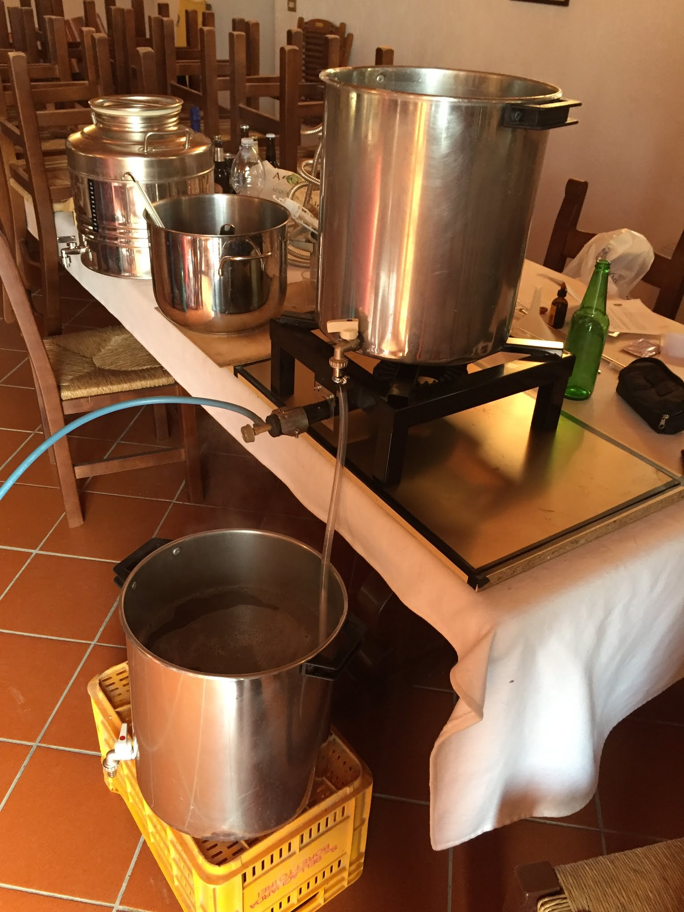
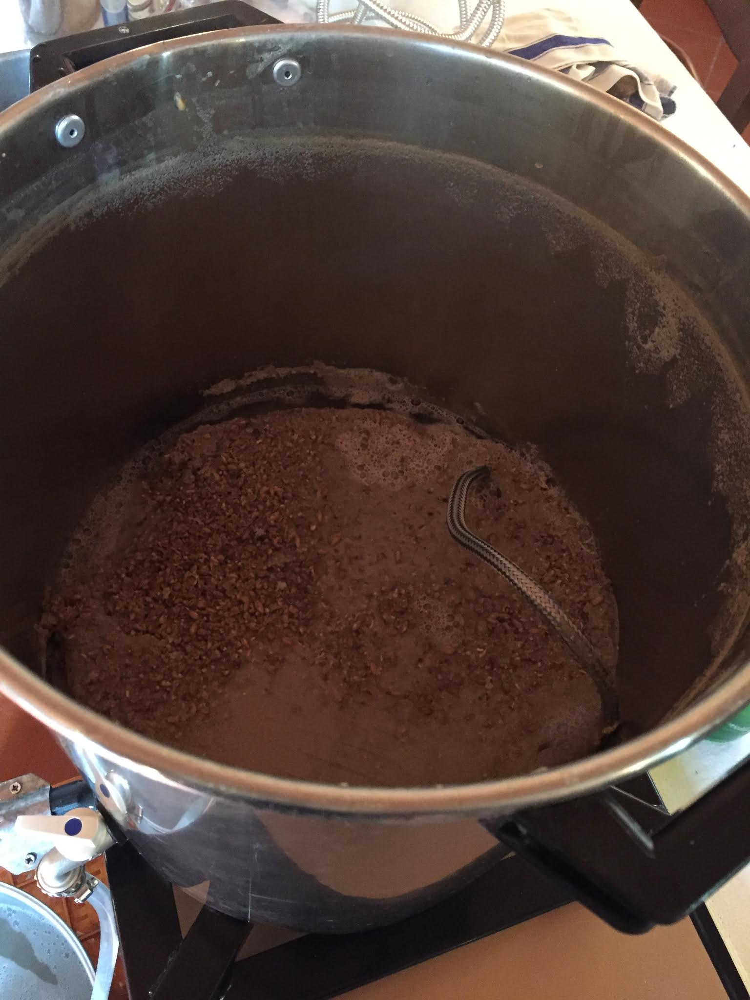
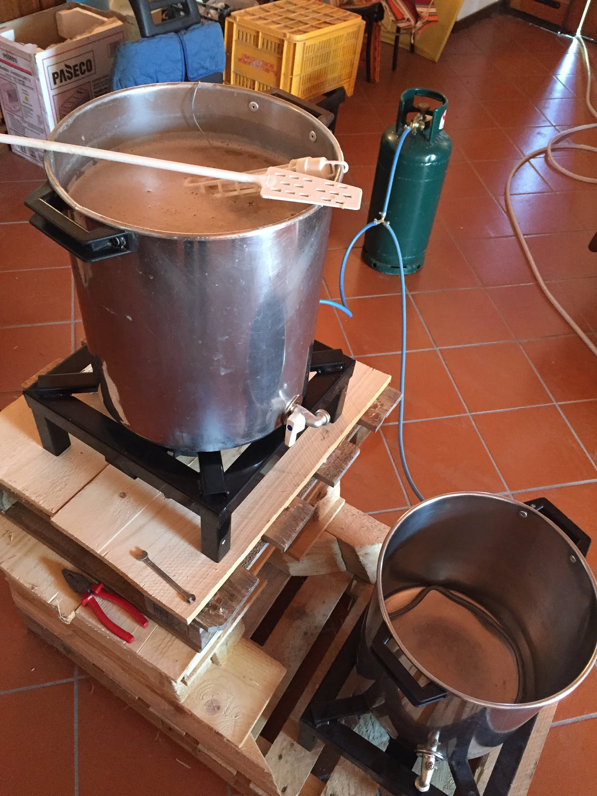
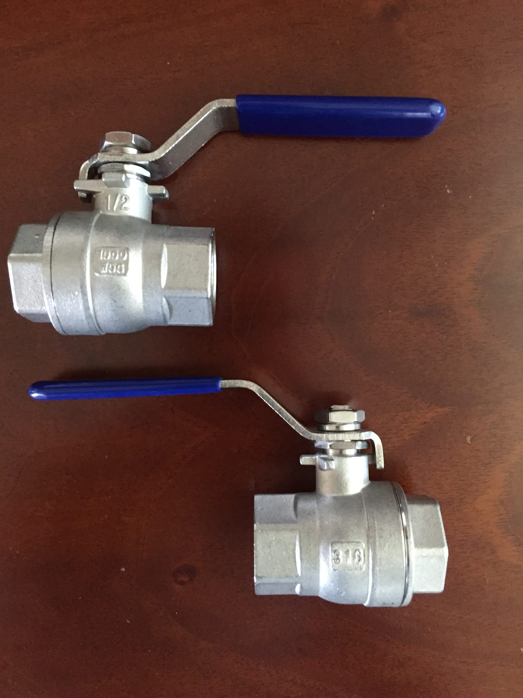
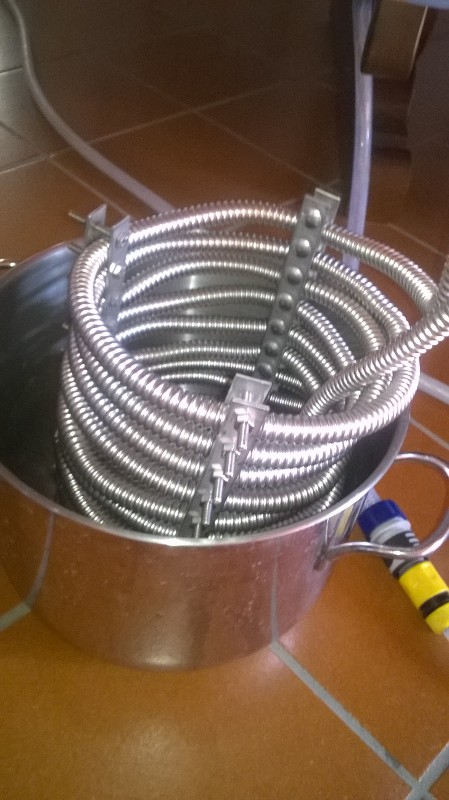

In questo articolo parlerò del mio primo impianto a tre tini creato insieme agli ex soci del gruppo brassicolo Ryan Biller. La prima versione del 2016 era composta da due fornelloni e tre pentole inox, due da 35 litri e una da 13 litri per lo sparge.

Quando cominciai a fare birra non me ne fregava un granché. Arrivai alla prima "cotta" da kit luppolato scazzato e con un paio d'ore di ritardo, d'altronde era domenica mattina e avrei preferito dormire piuttosto che veder due persone diluire un preparato.

Solo con la corsa agli armamenti per costruire il primo impianto all grain e ancor più la sera dopo la prima vera cotta il mio cervello cominciò ad attivarsi e pensare come ottimizzare il tutto.
Quell'insieme complicato di passaggi, step di temperature/tempi, travasi e controlli di processo avevano risvegliato in me il cervello dell'ingegnere e la sua atavica ossessione per l'ottimizzazione. Era il punto di non ritorno.

Userò il nome Mark per dare un'idea del versioning come l'armatura di Iron Man, cercando di raggruppare le modifiche fatte all'impianto nel corso del tempo.

### Mark 1
La prima versione venne utilizzata per la cotta del 02/04/2016. Consisteva in due pentole in acciaio inox da 35 litri forate con rubinetto e una pentola di dimensioni più piccole, sempre inox,  sui 12-13 litri da utilizzare per lo sparge.

Avevamo un solo fornellone da 8,5kw quindi richiedeva lo scambio delle due pentole grandi prima del boil.

L'acqua di sparge era scaldata parallelamente sul fornello di casa e poi versata lentamente su un mestolo forato e quindi sulla torta di trebbie tagliata a fette. Rimescolavamo per una quindicina di minuti facendo batch sparge.  
Vista la grande differenza di dimensioni delle pentole utilizzavamo 3,5/4 litri d'acqua per chili di malto per il mash e 2 per lo sparge ottenendo efficienze di mash del 70% circa.

Il filtro bazooka era ricavato da un tubo flessibile in inox, con tubo interno in gomma tagliato e rimosso. Per un anno ci siamo ostinati con questo tipo di filtri bazooka autocostruiti e abbiamo sempre avuto grandi problemi di filtraggio.  
Si piegano facilmente e tendono a muoversi quando si mescolano le trebbie rimanendo spesso impigliati nel mestolo, ma sopratutto si intasano sempre (e il frumento della weiss ovviamente non aiutava).

L'attrezzatura accessoria era veramente basilare: termometro a gabbietta (che si è sempre confermato affidabile e pratico nell'utilizzo a dispetto del milione di termometri digitali che ci hanno abbandonato) e ph misurato con le cartine tornasole.

### Mark 2
Nella seconda cotta abbiamo fatto alcune migliorie rispetto alla prima versione, nella quale mi sono reso conto del procedimento.  
Abbiamo aggiunto:
- Un fornello uguale al primo per parallelizzare il mash con il riscaldamento dell'acqua di sparge (e relativi attacchi alla bombola).
- La struttura di legno per la cascata.
- Filtro bazooka alla pentola di boil, migliorato il filtro bazooka della pentola di mash.
- Migliorata la serpentina di raffreddamento (aumentata la lunghezza e collaudato gli attacchi alle canne).
- Termometro digitale.
- Calza per luppoli.
- Phmetro.
- Stereo Jbl bluetooth che sparava trap ignorante per ore (fondamentale).

### Mark 3
Avevamo intenzione di fare molte modifiche in estate, come motorizzare la fase di mash, fly sparge e automatizzare l'impianto, poi per mancanza di tempo ci siamo tenuti essenzialmente quello che avevamo con qualche miglioria.
Abbiamo cambiato solo i rubinetti con due valvole a sfera in inox le quali ci consentivano anche di poter avvitare i rubinetti leggermente storti ma ben stretti.

Non abbiamo ancora parlato della serpentina di raffreddamento, che cominciò con un tubo inox da 6 metri nella Mark 1 poi raddoppiata nella Mark 2 a 12, con un giunto saldato. Nella terza versione abbiamo applicato una struttura per tenere ferme le spire ed evitare la dilatazione che faceva fuoriuscire troppo l'ultima parte di serpentina dal mosto. Ci è costata probabilmente più la struttura (6 pezzi rettangolari e forati per le morse più tante viti e bulloni, tutto inox) che la serpentina stessa. E non è venuta nemmeno come volevo a livello estetico, inoltre richiede attenzione per non rigare la pentola con le viti e anche qualche difficoltà nel pulirla. Lezione imparata: diffidate dal fai da te estremo. Non paga sempre in termini di tempo, risultato ottenuto e costo.

