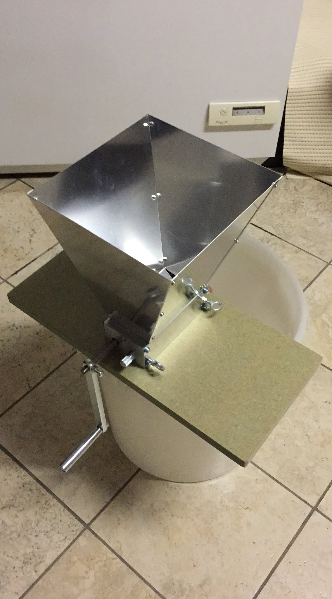
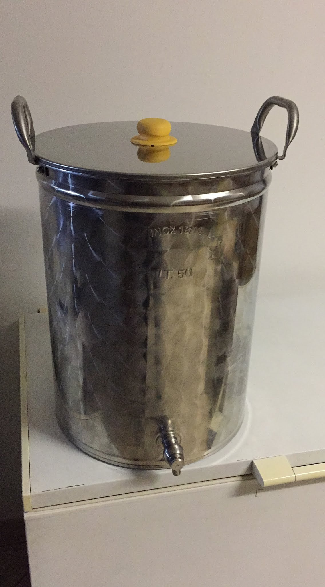
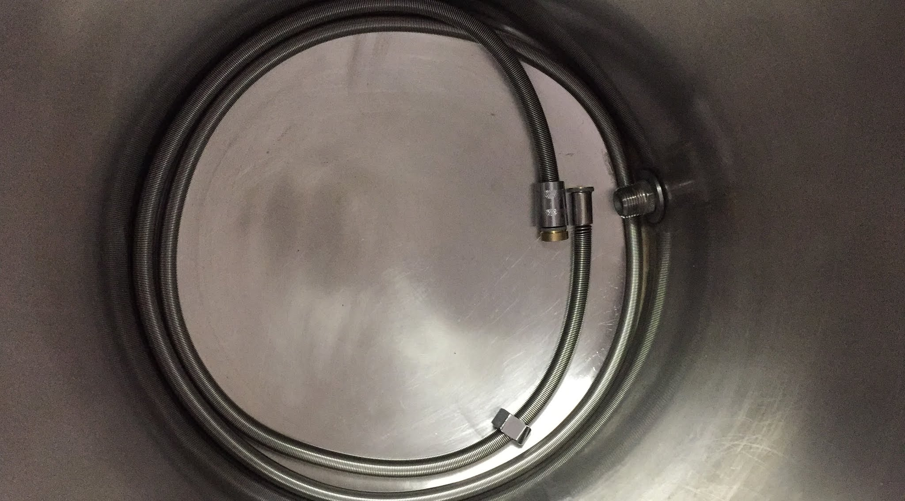
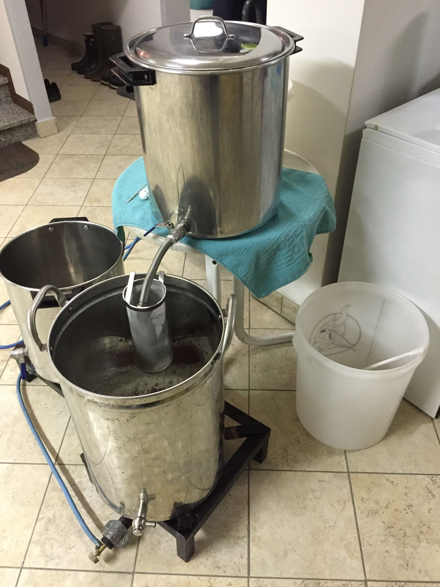
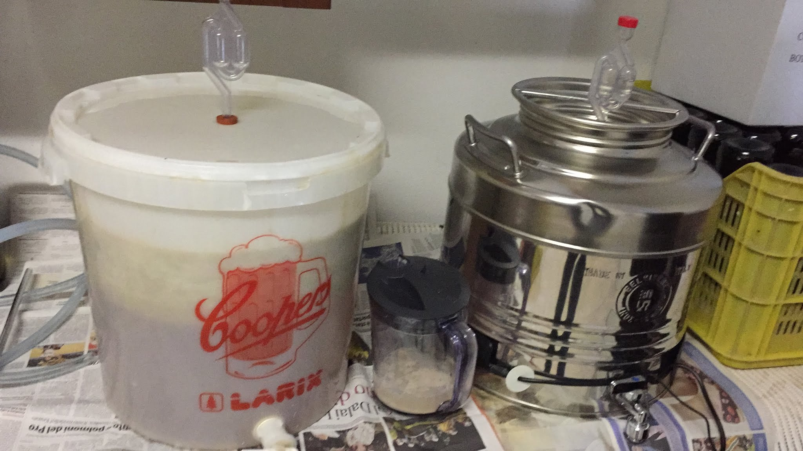
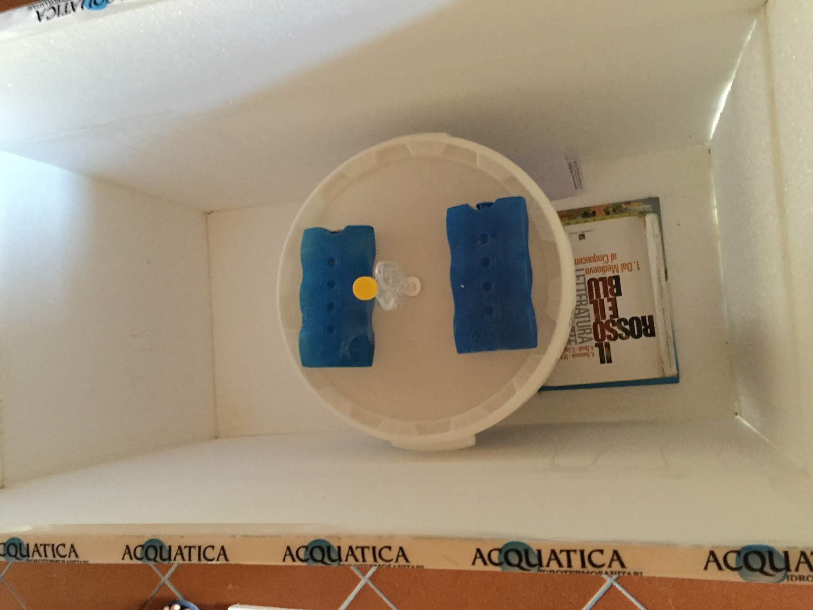
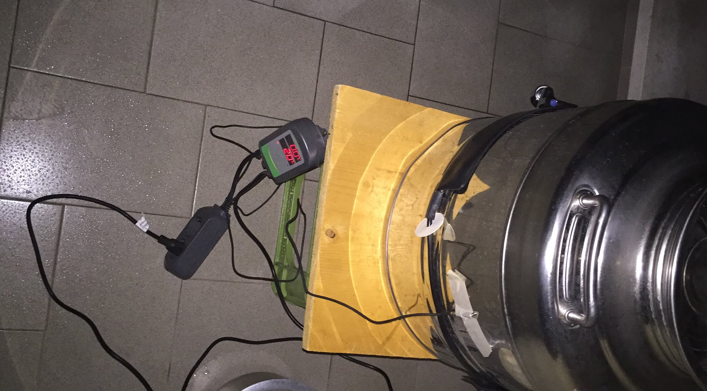

Continuo a parlare dell'evoluzione del nostro impianto a tre tini che venne aggiornato alla fine 2016 con una nuova pentola inox da 50 litri per la bollitura. L'impianto venne usato nei primi e negli ultimi mesi del 2017.

### Mark 4
I due upgrade maggiori all'impianto, avvenuti a cavallo fra 2016 e 2017 sono stati l'acquisto di un mulino a rulli (prima tritavamo i malti in un mulino agricolo elettrico che sfarinava troppo, non so dirvi di più perché... non l'ho mai visto!) e una terza pentola per bilanciare l'acqua di sparge con quella di mash.

Ovviamente non poteva mancare l'ennesimo tentativo di costruire un filtro bazooka con un tubo flessibile...  
E abbiamo cambiato location spostandoci a casa mia.

### Mark 5
Dopo aver usato il biab d'estate siamo tornati al tre tini alla fine del 2017 per volumi maggiori.

Le new entry sono state:
- un filtro semplice a rete (bastavano 8 euro su amazon per porre fine alle nostre sofferenze in filtraggio).
- L'imbottigliatrice enolmatic per rendere più agevole la fase più noiosa di tutte.
- un filtro per i luppoli troppo piccolo per la pentola ma utilizzato per filtrare le farine e ridurre l'ossigenazione nel trasferimento del mosto alla pentola di bollitura.
- Un frigor gigante (recuperato da un socio) per controllare meglio la fermentazione.

### Due cose sulla fermentazione
Abbiamo gestito le nostre cotte alternando i due classici fermentatori a secchio da 30 litri con un fermentatore in inox.

Durante il primo anno non abbiamo controllato la temperatura, se non tenendo a bada le temperature estive con una camera di fermentazione fai da te e quelle invernali con una fascia riscaldante.

In inverno ho anche provato a winterizzare (con ottimi risultati) sul balcone, sempre con la fascia riscaldante nel caso in cui la temperatura andasse sotto zero.

