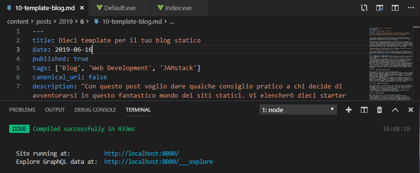

Dopo vari tentativi di bloggare le mie attività birrarie, questo dovrebbe essere il mio blog personale definitivo. Non parlerò solo di birra ma anche di tecnologia e di sviluppo web, a cominciare dagli strumenti con cui questo sito sta in piedi.

#### Blog artigianale
Rispetto ai vecchi **CMS** mancano la ricerca, i commenti e qualche chicca per le immagini, come l'apertura della galleria di tutte le foto del post quando si clicca su una di esse.  
Sono tutte mancanze da sviluppare a mano ma per ora posso permettermi il lusso di non avere un blog perfetto. Ho ancora poco seguito e per me è più importante cercare di implementare quelle funzionalità da solo per rendere il blog veramente mio ed artigianale. Ed avere qualcosa da raccontare, ovviamente.  
Intanto ho già implementato la paginazione in quanto nemmeno quella era nello starter.

#### Lo stile
Lo stile è esattamente quello che si trova nello starter di Gridsome e che mi ha attirato subito, specialmente l'interruttore per cambiare il tema. Nella lista delle cose da fare c'è anche una personalizzazione di questo, avevo pensato ad esempio di cambiare il tema dark da blu a grigio scuro.  Ma per ora è decisamente la cosa meno prioritaria che c'è.  
Qualcuno potrebbe obbiettare che il carattere di questo sito è veramente molto grande. È un `20px` è vero, ma voglio sfruttare questo tema anomalo per rendere il *tema* del sito più informale, scrivere più post e più corti. Ho avuto il vizio di scrivere articoli chilometrici negli scorsi blog ed ora sono costretto a spezzarli, finalmente.

#### Piacere di scrittura
Tastiera meccanica, Visual Studio Code con l'interfaccia scura e Markdown. Dico solo questo, spero sia un'immagine suggestiva per voi.

#### I post vecchi
Ho cominciato anche l'importazione dei post vecchi da [Enibeer](http://enibeer.blogspot.com/) in modo da storicizzare nel formato mardown le vecchie ricette e recensioni degli impianti. Tralascerò ovviamente quello che era strettamente legato a Blogspot/Wordpress. 

Il markdown mi permette di fare quello che sognavo da tempo, ovvero dare un layout tabellare alle ricette, senza dover sporcare il post con troppo HTML o usare immagini e avere così finalmente un post definitivo in markdown che in futuro potrà adattarsi ad ogni tema di blog possibile.

    #### Fermentabili
    | Tipologia     | Peso   |
    |---------------|--------|
    | Malto Pilsner | 2,5 kg |
    | Malto Weizen  | 2,5 kg |

    #### Luppoli
    | Varietà     | Tempo  |
    |-------------|--------|
    | Target      | 60 min |
    | Hersbrucker | 10 min |

    #### Lievito
    Fermentis Safale WB-06 