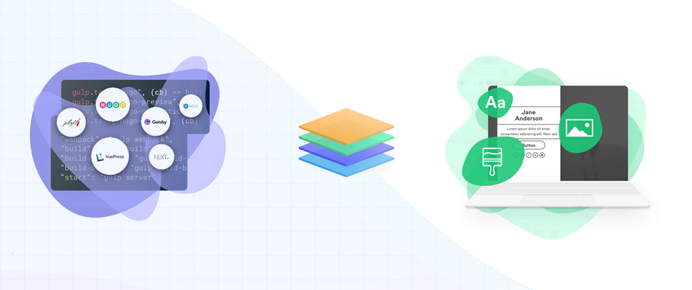

Sono passato da cms completi e dinamici come **Worpress** (sia come servizio su Wordpress.com che installato su hosting Aruba) e **Blogger** a un sito statico generato con **Gridsome**. Detto così sembra un passo indietro, almeno in termini di funzionalità.

Essendo un **sito statico**, per esempio, non ci sono (ancora) i commenti, perché in tal modo l'utente modificherebbe la versione statica che c'è sul server. Ogni volta che viene messo un nuovo post il sito dev'essere ricaricato e quella che si vede è di fatto la nuova versione del sito.

##### Ma allora perché?

Un sito statico ha una minore complessità rispetto ad uno dinamico, il che porta a molti vantaggi:
- Nessuna logica complessa lato server e database, sono solo pagine inviate dal server quando richieste.
- Costi ridotti, nel mio caso è tutto gratuito (vi sfido a trovare un hosting Ruby o .NET affidabili e gratuiti).
- Meno errori e problemi di sicurezza.
- Velocità di caricamento superiore.

**Ok ma tutte queste cose si facevano anche 20 anni fa, dov'è la novità e la praticità di una comoda interfaccia con cui scrivere i post?**

Qui entrano in gioco i generatori di siti statici. Io ho scelto Gridsome perché è basato su Vue.js (l'unico framework js che ho usato) ma ce ne sono per tutti i gusti. Alcuni esempi noti sono Hugo e Gatsby ma anche Jekyll si difende ancora bene. Menzione d'onore per Vuepress ma si addice di più al creare guide e wiki che al blogging e ai siti standard. In ogni caso li trovate tutti [qui](https://www.staticgen.com/).

Ecco alcuni vantaggi che mi hanno portato a scegliere Gridsome e più in generale l'approccio Jamstack per il mio blog:
- Facile da installare, ho fatto tutto con **VS Code** e il terminale integrato.
- Ottimi [starter](https://gridsome.org/starters) per i blog, io ho scelto [questo](https://github.com/gridsome/gridsome-starter-blog) perché da subito attratto dal pulsante per cambiare il tema.
- Vedo comodamente le modifiche in locale ed in tempo reale con il comando `gridsome develop`.
- Codice e hosting sono disaccoppiati: il primo è su **Github** ed il secondo su **Netlify**. Inoltre quando faccio un push sulla repository git si scatena in automatico una build su Netlify e dopo poco il sito cambia versione.
- Scrivere i post in [markdown](https://it.wikipedia.org/wiki/Markdown) non ha prezzo, è semplice e tutto viene visualizzato come vorresti. Ho sempre litigato con gli editor WYSIWYG di Wordpress e Blogger che mettono cose a caso. Senza contare che producono un html difficile da leggere e modificare manualmente.
- Anche se mi piace scrivere e pubblicare i post con VS Code ho configurato Netlify CMS perché si possa farlo direttamente con un interfaccia web. E con markdown ovviamente.

#### Riflessioni finali
Il grande pregio di questo approccio è anche quello di ritornare ad avere il pieno controllo sul codice del proprio sito.

Avere un progetto mio significa anche vederlo crescere aggiungendo mano a mano funzionalità, anzi crescere insieme a lui in termini di conoscenze e skill aquisite. Il tutto senza reinventare la ruota ma partendo da dei framework futureproof.

Gridsome è un'ottima opportunità per conoscere meglio **Vue.js** e **GraphQL**, senza dimenticare le basi (HTML,JS,CSS).  
Ciò che permette di fare questo framework va molto al di la delle mie attuali competenze e della mia fantasia.  
Per esempio potrei attingere non solo dai miei post in markdown ma anche da un CMS esterno come Wordpress, dai miei documenti su Google Drive (come i log delle cotte) e anche da un raspberry che raccoglie i dati di fermentazione di una birra. L'unico limite è la fantasia e mi piace sapere che un giorno potrei farlo.