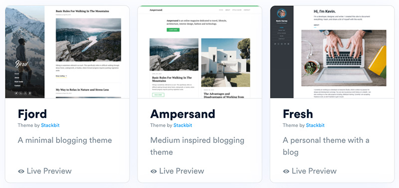
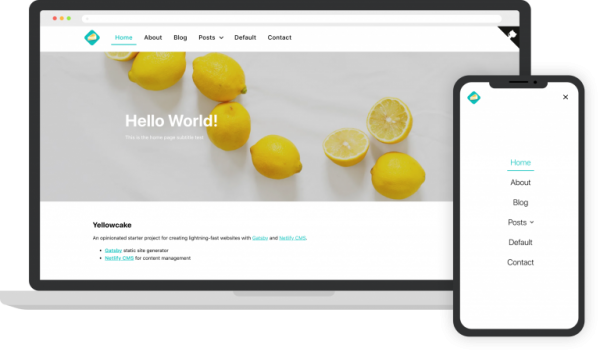
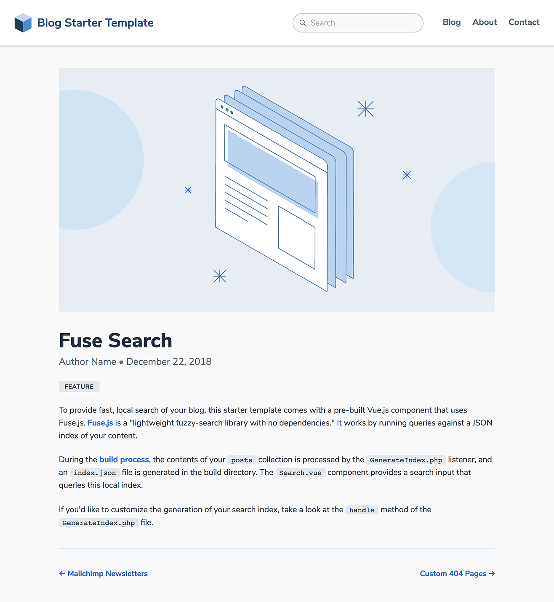
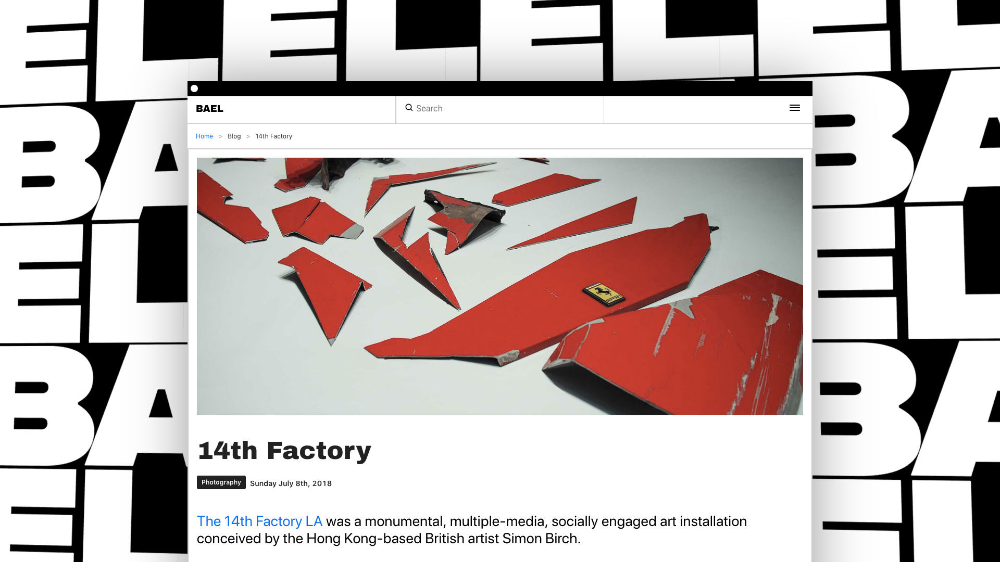
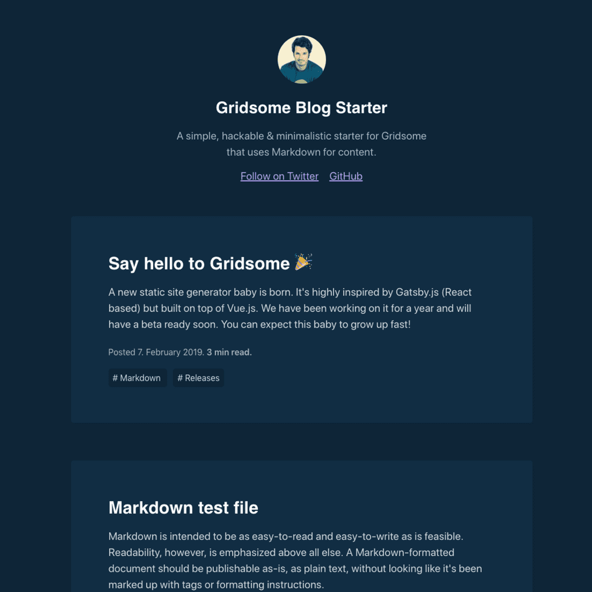
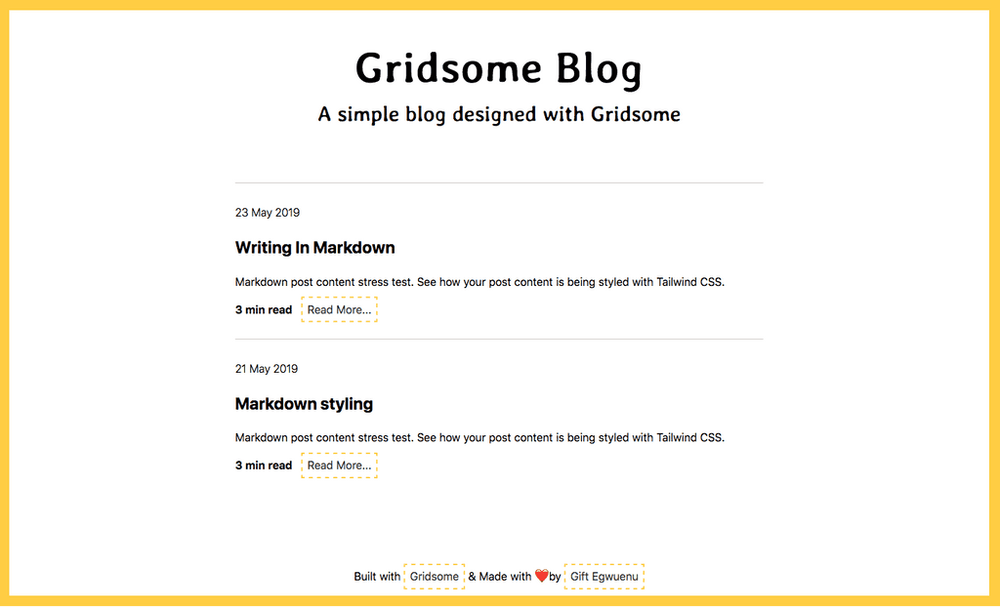
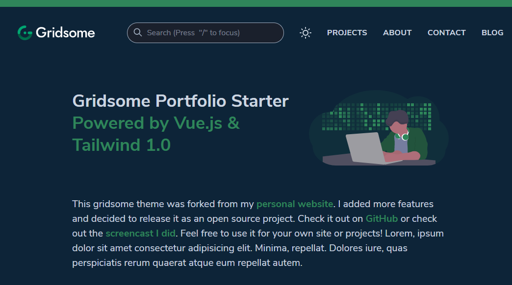

Con questo post voglio dare qualche consiglio pratico a chi decide di avventurarsi in questo fantastico mondo dei siti statici. Vi elencherò dieci starter fatti con varie tecnologie che ho valutato anch'io per creare il mio blog.

Penso che la prima cosa che bisogna guardare in un template sia la user experience e l'impatto estetico in modo da limitare gli interventi allo stile (che ci saranno in ogni caso) e non snaturare completamente l'idea che aveva il web designer. Pazienza poi se non è nel nostro framework preferito o manca di qualche funzionalità: si fa sempre in tempo ad aggiungerle sporcandosi un po' le mani e imparando cose nuove. Ovviamente se è bello e ha già tutto quello che cerchiamo in termini di funzionalità è ancora meglio.

Proprio per questo non mi focalizzerò tanto sulla tecnologia alle spalle ma cercherò di recensirvi il template in poche righe con i pro e i contro.

Ora vi elencherò dieci starter pronti all'uso che ho valutato nella creazione di questo blog, qualcuno provandolo anche in locale. Ovviamente ho tenuto in considerazione solo generatori di siti statici con i post scritti nel formato markdown (a parte un'eccezione).

### 1. [Stackbit](https://www.stackbit.com/)
Non è un template ma un comodo generatore di siti statici che fa tutto lui. È ancora beta ed occorre mandare una richiesta di iscrizione (come quando mi registrai a Gmail nel lontano 2006).

Se siete alle prime armi probabilmente è quello che fa per voi, permette di scegliere il tema, il generatore, l'eventuale CMS con cui postare tutto direttamente online e infine l'accoppiata Netlify/Github per la pubblicazione. I temi sono molto belli e curati, specie quelli pensati come landing page per app mobile o attività commerciali.

Quelli per i blog sono però un po' poveri a livello di funzionalità, mancano ad esempio i tag e la ricerca. Lo consiglierei per tutti quelli che non hanno bisogno di un blog, per i casi citati prima, o che ha funzionalità solo accessoria come nelle pagine personali con il proprio portfolio ed i  progetti in primo piano. Nulla vieta come dissi prima di aggiungere le cose mancanti a mano, visto che il tempo per metterlo in piedi è stato irrisorio!

### 2. [Yellowcake](https://github.com/thriveweb/yellowcake)
Probabilmente è il template più completo e multimediale di tutti. Non solo ha ricerca dei post, varie pagine ma anche la galleria delle foto, video in HTML5 con testo sovrapposto, mappe, form di invio messaggi, widget di instagram, menù a scomparsa... L'unica cosa che gli mancano sono i tag ma ha comunque delle sezioni in cui dividere i post, anche se i tag permetterebbero maggiore flessibilità.

Usa [Gatsby](https://www.gatsbyjs.org/), un popolare staticgen basato su [React](https://reactjs.org/), il famoso framework js di Facebook. Ve lo consiglio in caso voleste approcciarvi a gatsby e react oppure se vi servono molte funzionalità multimediali. Molto bello e sofisticato l'adattamento ai vari dispositivi e risoluzioni, anche se nel caso del mobile ho trovato un bug di sovrapposizione del testo nel menù a tendina.

### 3. [Jigsaw Blog Starter Template](https://jigsaw.tighten.co/docs/starter-templates/)
Graficamente è forse il più bello e curato di tutti. Proprio per questo lo vedo adatto a praticamente ogni blog, anche i più professionali. L'unico freno che ho avuto a usarlo è il linguaggio su cui si basa [Jigsaw](https://jigsaw.tighten.co/) e quindi [Laravel](https://laravel.com/): il famigerato e bistrattato PHP.  
Purtroppo sono prevenuto e non avendo intenzione di impararlo sono passato ad altro, anche se ho sempre sentito parlare bene del framework Laravel.

### 4. [Bael Template](https://github.com/jake-101/bael-template)
Mai sentito parlare di [Brutalist Web Design](https://www.html.it/03/03/2017/brutalist-web-design-il-trend-che-non-trova-freni/)? Ecco questo è un tema che lo implementa e dividerà chi lo ama e chi lo odia. A me personalmente piace ma non è per tutti, o meglio, per ogni tipo di blog. Potrebbe essere l'ideale per un blog di arte, architettura o moda, almeno finché [Balenciaga](https://www.balenciaga.com/it) non vi creerà problemi legali 😆.

A livello di funzionalità invece è ottimo, ha anche la ricerca e l'integrazione con il CMS di netlify (che anche i precedenti due hanno siccome li ho visti nella loro pagina degli esempi). La tecnologie utilizzate sono [Vue](https://vuejs.org/) (come tutti i prossimi cinque template) su cui a sua volta si basa [Nuxt](https://nuxtjs.org/), che in realtà è molto di più di un "semplice" generatore di siti statici.

### 5. [Vue Blog Demo](https://github.com/snipcart/vue-blog-demo)

Questa è l'eccezione di cui parlavo prima. Non funziona con un generatore di siti statici ma è basato direttamente su Vue.js. È ovviamente la soluzione più da smanettoni delle dieci citate, bisognerebbe infatti lavorarci un po', magari con un convertitore per il markdown.

Ho deciso di listarlo ugualmente perché l'animazione dell'apertura dei post è veramente bella, la vedrei bene come galleria di ricette birrarie.

<video autoplay="" muted="" name="media" loop="" style="width: 100%;">
    <source src="/videos/vuejs-blog-demo.webm" type="video/webm">
</video>

### 6. [Vuepress Blog Boilerplate](https://github.com/bencodezen/vuepress-blog-boilerplate)
Anche questo si basa su Vue.js ma usa [VuePress](https://vuepress.vuejs.org/), lo staticgen creato dal creatore di Vue (perdonatemi il gioco di parole), per generare il sito. É molto più adatto per creare documentazioni, guide e wiki che per il blogging, infatti è proprio quello il suo scopo.

In ogni caso voglio proporvelo per il singolare lavoro del suo creatore, è la dimostrazione che sapendo toccare pochi fili giusti si può adattare una tecnologia a tutt'altro scopo.
E vedere Evan You in persona a far magie con il codice è impagabile.

### 7. [Gridsome Starter Blog](https://github.com/gridsome/gridsome-starter-blog)
Questo mi sembra familiare, forse perché è proprio quello che ho scelto per il mio blog. Mi ha attirato fin da subito il toggle per cambiare il tema, siccome c'è l'eterna divisione da chi non potrebbe rinunciare alla leggibilità del bianco e quelli che vorrebbero il tema dark dappertutto (anche su Google) come me. Così sono tutti contenti.

Essendo lo starter ufficiale di Gridsome mi ha attirato da subito anche la semplicità e la pulizia grafica, inolte è completamente focalizzato sul blogging come piace a me.

Mancano un po' di funzionalità di base come la ricerca e anche la paginazione, inoltre ho dovuto mettere a punto anche la visualizzazione delle immagini in formato portait (quelle alte e strette per dire) che venivano allargate al massimo diventando giganti, anche se non sono ancora convinto al 100% per lo meno ho messo una pezza.

### 8. [Gridsome Starter Bleda](https://github.com/cossssmin/gridsome-starter-bleda)
Un'altro starter che ho considerato per il mio blog quando ho cominciato ad avere problemi con le immagini.  
Questo ha infatti l'ingrandimento dell'immagine al click, inoltre permette di creare dei post con l'immagine di copertina in scomparsa molto professionali e mi sembra sia l'unico dei citati ad offrire il nome dell'autore del post, ideale per i blog gestiti da più persone.  
Il codice inoltre mi sembrato più elegante e conciso dei precendente, specie nei css (forse è dovuto a Tailwind CSS).

### 9. [Gridsome Minimal Starter](https://github.com/lauragift21/gridsome-minimal-blog)
Questo starter minimale ha un approccio grafico che mi ricorda quello del vecchio blog [Ryan Biller](https://ryanbiller.wordpress.com/), molto informale.  
Per questo ve lo consiglio. Preparatevi a smanettare però, perché è abbastanza scarno per quanto riguarda le funzioni disponbili.

### 10. [Gridsome Portfolio Starter](https://github.com/drehimself/gridsome-portfolio-starter)
Questo starter l'ho preso in seria considerazione quando si è trattato di capire come implementare la ricerca (che al momento non ho ancora fatto). È fatta con il plugin [Vue Fuse](https://github.com/shayneo/vue-fuse), che dovrò utilizzare anch'io, almeno so che si può fare semplicente senza servizi esterni come Algolia. 

Forse l'unica cosa che ci andrebbe aggiunta è la ricerca anche per tag. Per il resto sembra una versione potenziata del Gridsome Starter, tema dark incluso ma anche la paginazione. 

L'unico motivo per cui non sono passato a questo è il fatto che Eniblog deve avere come prima funzione quello di essere un blog mentre questo mi sembra più un sito con blog annesso, anche la lista dei post è leggermente più "brutta", con l'assenza dei tag nelle anteprime dei post e anche di eventuali cover.
In ogni caso mi affiderò [ai tutorial del suo creatore](https://www.youtube.com/channel/UCtb40EQj2inp8zuaQlLx3iQ/featured) per implementare quello che mi manca.

## Conclusioni
Ho tralasciato molti temi di altri static gen (come [Jekyll](https://jekyllrb.com/) che provai come primo in assoluto), ma questa è solo una panoramica veloce per darvi un'idea di quanti punti di partenza per un sito/blog possono esserci.

Alcuni con già la *pappa pronta* mentre altri vi daranno più spazio a personalizzazioni ed estro personale. Ma in ogni caso niente è fissato nella pietra come i classici CMS monolitici che agiscono come scatole nere al cui interno non è dato sapere le magie che avvengono.

**Ora che la jamstack è diventata popolare ed accessibile non avrete più scuse per non condividere i vostri hobby online!**

