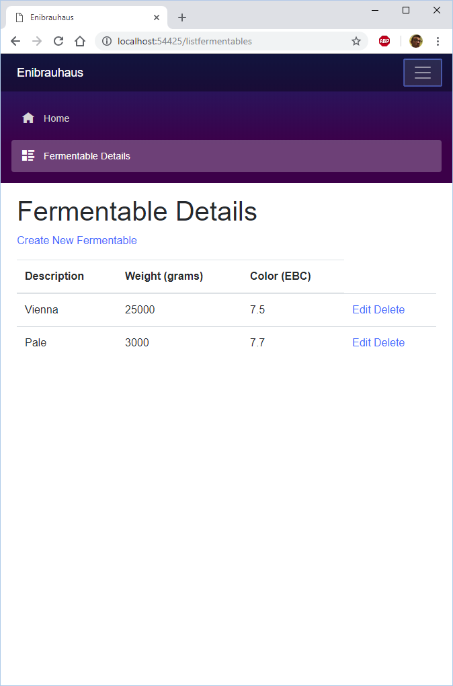

Enibrauhaus è il nome scherzoso che ho dato al mio birrificio/cantina casalinga ma in futuro potrebbe diventare molto più tecnologico e... virtuale.

### Stack tecnologico attuale della Enibrauhaus
Da quando sono ripartito l'anno scorso ho cercato di razionalizzare l'utilizzo degli strumenti tecnologici in tutta la catena produttiva facendo una scaletta:
- Gestione archivio: fogli di calcolo su Google Sheets
- Calcolo ricetta: [BrewOnline](https://www.brewonline.net/)
- Controller cotta: originale del Brauheld
- Calcolo acqua: foglio di calcolo [EZ Calculator](http://www.ezwatercalculator.com/) (non mi funziona bene su Google Sheets e devo usarlo con openoffice)
- Controllo frigor fermentazione: termostato Inkbird ITC-308 che controlla frigo e base riscaldante
- Controllo densità fermentazione: Tilt e relativa app bluetooth
- Priming: foglio di calcolo di Brewingbad
- Appunti della cotta/appunti assaggi/log imbottigliamento: Google Drive/Samsung Notes (scritti a penna sul tablet)

Da sviluppatore web, ha cominciato a ronzarmi in testa un grillo sempre più insistente: perché non tendere verso un'integrazione maggiore di questi elementi?
> Perché non avere un'orchestra armoniosa anziché tanti applicativi eterogenei e stonati?

### Calcolo delle ricette
Inizialmente non avevo intenzione di scrivere linee di codice, avevo pensato a [Brewfather](https://brewfather.app/) e la sua collaudata integrazione con tilt e un futuro controller del klarstein del tipo [Smartpid](http://smartpid.com/).

Poi ho cominciato a strendere una ricetta con brewfather e non mi sono trovato bene, specialmente nell'impostare l'efficienza direttamente nell'impianto.  
Non che non mi piaccia l'app Brewfather, anzi, è un capolavoro di usabilità e al vertice delle tecnologie lato web attuali. Basti pensare che è una single page application e certificata come progressive web app: se volete approfondire questi aspetti tecnici date un'occhiata [qua](https://deanhume.com/brewfather-progressive-app-review/).

Il mio modus operandi dell'utilizzo di brewonline era diverso, partivo da un quantitativo di grani base fisso e giocavo con le percentuali e valori di grammi speciali sensati (che senso ha fare 217 grammi di carared? o 200g o 250g...). Poi mi regolavo con l'acqua e riportavo i litri ottenuti nei valori in alto di litri in pentola/fermentatore per cercare di stare nel range dello stile. In pratica cerco di fare una quadra ad occhio.

Mi ritrovo con [l'approccio](https://www.youtube.com/watch?v=H09Z0AH_18U) del creatore di brewonline : "preoccupatevi prima di tutto dei risultati ottenuti, di produrre qualcosa di bevibile, piuttosto che al valore esatto di IBU o del EBC", anche se a molti homebrewer scientifici potranno sanguinare gli occhi a leggere ciò. Quando comincerò ad avere una certa stabilità, solo allora entrerò più nel dettaglio, anche attraverso una maggior comprensione delle fatidiche formule dei vari parametri come GU/IBU/EBC...

Ed è qui che venne l'illuminazione: perché non cucirmi addosso un'app che segua di pari passo la mia compressione delle formule? Tanto alla fine c'è comunque da lavorare a integrare tutto (con conseguente tempo perso a capire come fare), tanto vale partire da un foglio bianco. Mal che vada continuo col mio metodo arcaico che ho elencato sopra.  
E poi ci sono i fogli di calcolo usati come applicazione, nel 2019 mi sembrano anacronistici. Di fatto è anche il motivo perché le aziende si muovono da Excel agli applicativi gestionali, senza i quali sarei disoccupato 😂.

### Cose automatizzabili
La prima cosa integrabile che mi viene in mente è la stesura della ricetta insieme al profilo dell'acqua, al fine di fare le giuste correzioni di sali e ph. La cosa che mi da fastidio, oltre al fatto di usare foglio excel che ho già detto, è di dover definire il grist due volte. Uno in brewonline e uno in ez calculator. **Don't repeat yourself!**

Poi ovviamente mentre si calcolano i valori dell'acqua a partire dal grist/quantitativi di acqua/profilo dell'acqua si stende anche la ricetta. Allora vanno implementate le formule di calcolo. Qua ho anche troppo materiale da cui attingere. Un po' di fonti che mi vengono in mente:
- Fogli di calcolo Birramia e Brewing Bad.
- Libri come Progettare Grandi Birre.
- [Approfondimenti sui calcoli](https://www.bonuccelli.it/josephbraeuerei/category/homebrew/) scritti molto bene.

Un'altra chicca che mi viene in mente è l'esportazione delle tabelle dei fermentabili e aggiunte in bollitura in **markdown** in modo da compilare direttamente il mockup del post della birra in questione. Cucirsi un software del genere serve appunto a questo... Sai quello che ti serve e lo implementi, contrariamente a un brewfather di cui sfrutterei poco il potenziale.

### Si ma la tecnologia?
Quando scrissi l'articolo originario su [Enibeer](http://enibeer.blogspot.com/2019/02/enibrauhaus-10.html) ero stato folgorato dal web assembly per la sua mission di portare il C# nel frontend, lo sono ancora tuttora che non è più in beta ma in rc. Però dopo la creazione di questo blog ho più dubbi. Perché fondamentalmente sto usando gridsome che si basa su Vue.js che è fatto nel malefico Javascript.

Entrambe le soluzioni però hanno in comune l'idea di delegare il quanto più possibile al client, come i vari calcoli della ricetta e utilizzare il server solo per autenticazione e salvataggio delle ricette e informazioni varie di cotte, fermentazioni ecc... Quest'ultimo implementato con funzioni serverless.
Appesantendo il client si snellisce il server a tal punto che queste operazioni possono essere eseguite come funzioni in cloud e non richiedono un server dedicato sempre attivo. Con enormi benefici di sicurezza, costi e mancanza di configurazioni dei server. Quale provider cloud scegliere è la vera decisione importante.

Per esempio pensiamo al calcolo dell'alcalinità residua a partire dai valori dei sali minerali: non voglio il click di un bottone per eseguire il calcolo passando per il server, voglio subito il ricalcolo nella casella di testo come avverrebbe in excel. E poi salvare tutto su un db come quando salvo il documento, mentre ora mi tocca avere una versione non compilata da copiare per ogni birra. Ecco perché li reputo anacronistici.

##### Team C#
- Frontend [Blazor](https://dotnet.microsoft.com/apps/aspnet/web-apps/client). In questi mesi ha macinato tappe importanti, passando da beta a preview. Si sa quindi che Microsoft lo supporterà e verrà integrato quello serverside (che a me non interessa) in .NET Core 3 (fine 2019) mentre Blazor puro client side sarà rilasciato dopo, probabilmente con .NET 5 nel 2020.
- UI: un progetto Blazor ha già installato il collaudato Bootstrap. In questo momento la grafica è l'ultimo dei miei problemi e quella di default non è affatto male, è già responsive e mobile first. Ma se devo proprio sbilanciarmi andrei di [SemanticUI](https://semantic-ui.com/) perché è veramente bello.
- Backend e Db: scegliere il provider cloud non è semplice.  
Il piano gratuito attuale di [Amazon AWS](https://aws.amazon.com/it/free/) offre 1 milione di funzioni e sopratutto un DB NoSql da ben 25 gb che saturerei solo se avessi gli stessi utenti di brewfather probabilmente. Cioè mai. Lo svantaggio è aver lo spazio di hosting S3 gratuito per un anno, anche se poi mi costerebbe poco avendo un sito piccolo.  
[Google Cloud Platform](https://cloud.google.com/free/) di contro offre molto meno DB (1 gb che sarebbe sufficente per uso personale) ma ben 2 milioni di funzioni e soprattutto 5gb di storage per sempre, sicuramente sufficenti.  
[Azure](https://azure.microsoft.com/it-it/free/) sarebbe stata la soluzione che più si sposava con l'ecosistema Microsoft ma non offre il db gratuito quindi mi tocca escluderlo.  
Ovviamente per il db (no sql) sfrutterei DynamoDB/Firestore mentre per il linguaggio delle function la scelta sarebbe ovviamente C#.

##### Team Javascript
- Frontend in Vue.js o qualche framework che si basa su di esso come Nuxt. Oppure un [boilerplate](https://github.com/chrisvfritz/vue-enterprise-boilerplate#faq) cioè un template da seguire per strutturare l'applicativo. Nel link sono anche spiegati i pro e i contro di questa scelta. Ancora più sensato quindi partire direttamente dalla [Vue CLI 3](https://cli.vuejs.org/).
- UI: anche qua c'è l'imbarazzo della scelta. Bootstrap, SemanticUI oppure [Vuetify](https://vuetifyjs.com/en/) se voglio il material design. Ma la scelta più semplice è non scegliere niente, ovvero tenere quello stock di Vue e decidere in seguito.
- Backend e Db: qua sfrutterei subito Netlify e le sue [Functions](https://www.netlify.com/products/functions/) che altro non sono che lambda function su Aws. Offre più limitazioni ad esempio il numero delle function e i linguaggi usabili (Js e Go, ovviamente userei il primo per avere tutto in Js).  
Se poi avessi bisogno di più potenza potrei migrare al *vero* AWS in quanto l'hosting potrebbe rimanere su Netlify e non mi servirebbe S3. Oppure migrare tutto su Amazon, DB su Dynamo incluso.  
Per quanto riguarda il db sfrutterei per ora GraphQL di cui sto imparando i rudimenti, che va a salvare i dati su un json. Per integrarlo a Vue basta il plugin Apollo e partirei sicuramente [da qua](https://markus.oberlehner.net/blog/how-to-use-graphql-with-vue-apollo-components-and-netlify-functions/) per creare la mia app.

Quale dei due approcci vincerà? Sicuramente un peso importante nella scelta sarà vedere l'evoluzione di queste due piattaforme. Se da un lato Blazor diventerà stabile con la 1.0 nelle future versioni di .NET Core anche Vue passerà alla versione 3. Attualmente sono più propenso alla seconda soluzione perché mi sembra più semplice e affine a quello che sto facendo ora. Sopportando Javascript.  
Ultima chicca: Vuepress per la guida. Serve più che altro a me per non dimenticarmi come si utilizza la mia stessa app 🤣.

### Internet delle cose
Se ho ancora dubbi sull'architettura web ancora meno ne so per quanto riguarda l'IOT/elettronica e come si potrebbe controllare il tutto da un'interfaccia web.  
Per il Tilt sono già dotato di un Raspberry Pi zeroB (per [tilt pi](http://www.rovidbeer.it/tilt-pi-v2/), che non ho ancora testato) mentre per automatizzare la produzione e la fermentazione la strada è ancora lunga, ho pensato a CraftBeerPi per la sua "customizzabilità" ma ho letto cose interessanti dell'ESP8266 che sembra anche più basilare e simile ai miei concetti di less is more.  
Ma la potenza di un raspberry mi permetterebbe di abbinarci uno schermo touch da 3,5 pollici (che ho già). Parvenze di [brewtools](https://www.brewtools.no/en/)...

In ogni caso procederò a piccoli passi e spero che entro natale si cominceranno a vedere le prime soluzioni, d'altronde lo spirito è sempre:
> Relax, Don't Worry, Have A Homebrew.

